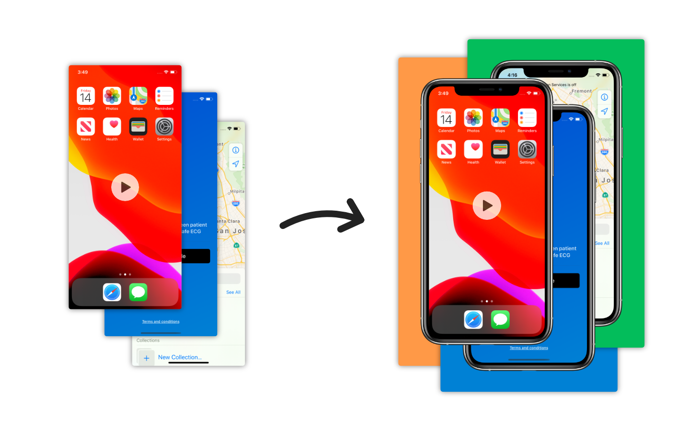

<div align="center">
  
  <h1>ScreenFramer</h1>
  <h5>Frame recordings from your apps using device mockups.</h5>
  <br>
</div>


This is command-line tool which helps to put screen recordings from your apps or prototypes in device frames from iPhone, iPad and Apple Watch.

## Why?

I often record my app prototypes running in iOS simulator or on device to share on Github or social media. But these recordings don’t come with device frame overlay, and applying it is just not as easy as it is with still images. It’s also really inconvienient to open Final Cut Pro or iMovie (frankly it’s not even possible to do it there without tricks) just for that. So I’ve created simple command-line tool for that (and then macOS GUI app too).

<div align="center">
  
</div>

## Features

* Templates for modern models of iPhone, iPad and Apple Watch
* Ability to choose video background color
* Ability to control video dimensions
* Outputs video using H.264 codec
* Command line interface

## macOS App

If you prefer using graphical user interface, there is native macOS app available for symbolic price.

[](https://apps.apple.com/pl/app/screenframer/id1527621584?l=pl&mt=12)


## Install

If you're using macOS, you can install via [Homebrew](https://brew.sh):

```
brew tap fredyshox/tools
brew install screenframer
```

For platforms other than mac, you can build from source.

## Usage

To overlay screen recording at `INPUTPATH`, and save output at `OUTPUTPATH` run:

`screenframer [OPTIONS...] INPUTPATH OUTPUTPATH`

Available options:

* `-t, --template arg` Device template name (default - `iphone11`). Look at available templates below.
* `-w, --width arg` Output video width (default - template width)
* `-h, --height arg` Output video height (default - template height)
* `-c, --color arg` Background color in hex (default - #000000)

### Available templates

##### iPhones

* iPhone 11: `iphone11`
* iPhone 11 Pro: `iphone11pro`
* iPhone 11 Pro Max: `iphone11promax`
* iPhone SE (2020) Black: `iphonese-black`
* iPhone SE (2020) White: `iphonese-white`

##### iPad

* iPad: `ipad`
* iPad Pro 11 (3/4 gen): `ipadpro11`
* iPad Pro 12.9 (3/4 gen): `ipadpro129`

##### Apple Watch

* Apple Watch Series 5 with Black band: `applewatchseries5-blackband`
* Apple Watch Series 5 with White band: `applewatchseries5-whiteband`

##### iPod Touch

* iPod Touch (5/6/7 gen) Silver: `ipodtouch-silver`
* iPod Touch (5/6/7 gen) Blue: `ipodtouch-blue`

### Examples

Create video with iPhone 11 Pro frame, over white background, with width equal to 960 (while maintaining proper aspect ratio).

```
screenframer --template iphone11pro --width 960 --color '#FFFFFF' INPUTPATH OUTPUTPATH
```

Create video with Apple Watch Series 5 frame, over green background, with height equal to 480.

```
screenframer --template applewatchseries5-blackband --height 480 --color '#03BD5B' INPUTPATH OUTPUTPATH
```

## Build

### Requirements

* C++17
* clang++
* CMake 3.16+

### Dependencies

* [nhlomann-json](https://github.com/nlohmann/json) 3.8+
* [cxxopts](https://github.com/jarro2783/cxxopts) 2.0+
* [OpenCV](https://opencv.org) 4+

If you're using Homebrew, just type `brew install nhlomann-json cxxopts opencv`.

Project is also using [cpptqdm](https://github.com/aminnj/cpptqdm), which is located in [Dependecies directory](/Dependencies/tqdm/tqdm.hpp).

### Building from source

```
mkdir Build/
cd Build/
cmake .. -DCMAKE_BUILD_TYPE=Debug
make
```

### Install from source

Install at path `prefix`

```
mkdir Build/
cd Build/
cmake .. -DCMAKE_BUILD_TYPE=Release -DCMAKE_INSTALL_PREFIX=${prefix}
make install
```

## FAQ

### Gif support

Not at the moment. But there are cool convertion tools for that, like [Gifski](https://gif.ski/).

## TODO

* [ ] GPU support using OpenCL
* [ ] Templates in landscape mode
* [ ] Templates for older devices
* [ ] Gradient background
* [ ] Auto template selection based on video aspect ratio
* [ ] Linux support (distribution)
